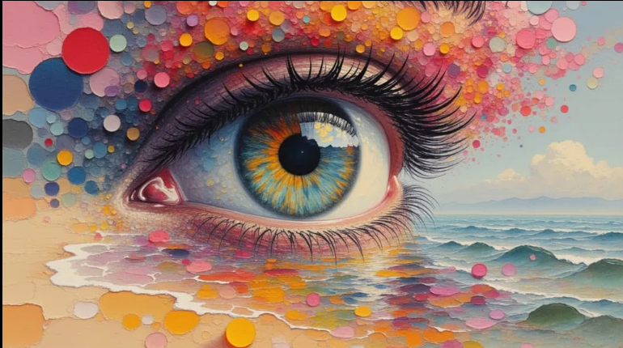
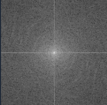
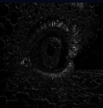
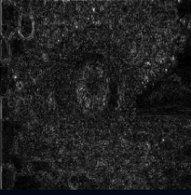
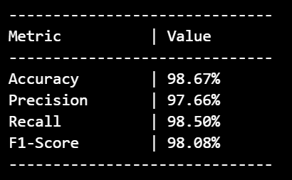

# 🤖 AI-Generated vs Real Image Detection using Deep Learning

A deep learning-based forensic framework for detecting AI-generated and real images using multi-signal forensic analysis. The project combines RGB information with FFT, Noise Residual, and Error Level Analysis (ELA) features to improve AI image detection performance.

---

# 🚀 Live Demo

- Live Demo: https://huggingface.co/spaces/Simran-092/ai-vs-real-detector

---

#  📌 Project Overview

The rapid advancement of generative AI models such as Stable Diffusion, Midjourney, and GAN-based architectures has made AI-generated images highly realistic and difficult to distinguish from real photographs.

This project focuses on detecting hidden forensic inconsistencies present in synthetic images by combining multiple forensic signals with deep learning. Instead of relying only on RGB image information, the framework analyzes images using:

| Signal         | Purpose                       |
| -------------- | ----------------------------- |
| RGB            | Visual information            |
| FFT            | Frequency-domain patterns     |
| Noise Residual | Noise inconsistencies         |
| ELA            | Compression-related artifacts |


These forensic signals are fused into a unified 6-channel tensor and passed through a modified ResNet50 architecture for binary classification.


---


# ⚙️ Tech Stack

| Technology | Purpose |
|---|---|
| Python | Core programming language |
| PyTorch | Deep learning framework |
| OpenCV | Image processing |
| NumPy | Numerical operations |
| ResNet50 | CNN backbone |
| Gradio | User Interface |
| Hugging Face Spaces | Deployment |


---


# ✨ Key Features

- Multi-signal forensic analysis  
- FFT, Noise Residual, and ELA feature extraction  
- Modified ResNet50 architecture  
- 6-channel forensic tensor fusion  
- Binary classification framework  
- Interactive web deployment using Hugging Face Spaces  
- Real-time inference support  

---

# 🏗️ Project Pipeline

```text
Input Image
      ↓
Image Preprocessing
      ↓
FFT Extraction
Noise Residual Extraction
ELA Extraction
      ↓
6-Channel Tensor Fusion
      ↓
Modified ResNet50
      ↓
Prediction (AI / Real)


---

# 📂 Dataset

## Dataset Used

```text
Parveshiiii/AI-vs-Real
```

## Dataset Processing

- Balanced dataset sampling performed
- Images resized to 224×224
- Dataset shuffled before training
- Train-validation split applied

---

# 🖼️ Extracted Forensic Features

The following forensic representations are extracted from the input image during preprocessing and feature extraction.

<p align="center">
  
</p>

<p align="center">
  <b>AI Image</b>
</p>

<br>

<p align="center">
  
  
  
</p>

<p align="center">
  <b>FFT Analysis</b>
  &nbsp;&nbsp;&nbsp;&nbsp;&nbsp;&nbsp;&nbsp;
  <b>Noise Residual</b>
  &nbsp;&nbsp;&nbsp;&nbsp;&nbsp;&nbsp;&nbsp;
  <b>ELA Map</b>
</p>

---

# 🧩 Multi-Signal Tensor Fusion

The extracted forensic features are combined with RGB channels to create a unified 6-channel tensor.

## Tensor Structure

| Channels | Description |
|---|---|
| 3 Channels | RGB |
| 1 Channel | FFT |
| 1 Channel | Noise Residual |
| 1 Channel | ELA |

## Final Tensor Shape

```text
(6, 224, 224)
```

---

# 🧠 Modified ResNet50 Architecture

The original pretrained ResNet50 architecture was modified to support forensic feature fusion.

## Modifications Performed

- First convolution layer modified from 3-channel input to 6-channel input
- Transfer learning performed using pretrained ImageNet weights
- Final classification layer modified for binary prediction

The model learns both visual and forensic patterns simultaneously.

---

# 📊 Results

## Validation Accuracy

```text
~98%
```

📈 Performance Metrics
<p align="center">  </p> <p align="center"> <b>Performance Evaluation Metrics</b> </p>


🧩 Confusion Matrix
<p align="center">  </p> <p align="center"> <b>Confusion Matrix for AI vs Real Image Classification</b> </p>

---

# 💻 Installation

## Clone Repository

```bash
git clone <your-github-link>
cd ai-vs-real-image-detection
```

---

## Install Dependencies

```bash
pip install -r requirements.txt
```

---

# ▶️ Run Locally

```bash
python app.py
```

---

# 👩‍💻 Author

## Simran Kumari

B.Tech CSE | NIT Jamshedpur  
Aspiring Data Scientist & Machine Learning Engineer